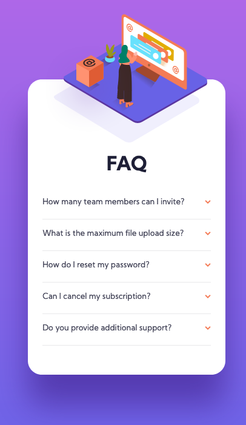

# Frontend Mentor - FAQ accordion card solution

This is a solution to the [FAQ accordion card challenge on Frontend Mentor](https://www.frontendmentor.io/challenges/faq-accordion-card-XlyjD0Oam). Frontend Mentor challenges help you improve your coding skills by building realistic projects. 

## Table of contents

- [Overview](#overview)
  - [The challenge](#the-challenge)
  - [Screenshot](#screenshot)
  - [Links](#links)
- [My process](#my-process)
  - [Built with](#built-with)
  - [What I learned](#what-i-learned)
  - [Continued development](#continued-development)
- [Author](#author)
- [Acknowledgments](#acknowledgments)

**Note: Delete this note and update the table of contents based on what sections you keep.**

## Overview

### The challenge

Users should be able to:

- View the optimal layout for the component depending on their device's screen size
- See hover states for all interactive elements on the page
- Hide/Show the answer to a question when the question is clicked

### Screenshot




### Links

- Solution URL: [github](https://github.com/norman02/faq-accordian-card.git)
- Live Site URL: [vercel](https://faq-accordian-six.vercel.app/)

## My process

### Built with

- Mobile-first workflow
- Sass with 7-1 design pattern
- HTML 5
- Vanilla JavaScript


### What I learned

I learned how to add an event listener to multiple items:
```js
document.querySelectorAll('.list-item').forEach(item => {
    item.addEventListener('click', event => {
      if (!item.classList.contains('active')) {
          item.classList.add('active')
      } else {
          item.classList.remove('active')
      }
    })
  })
```


### Continued development

I struggled with the layout, particularly lining up multiple images. I am going to ask the community for advice on this

## Author

- Facebook - [John Norman](https://www.facebook.com/john.norman.1800)
- Frontend Mentor - [@norman02](https://www.frontendmentor.io/profile/norman02)
- Twitter - [@JohnIsNorman](https://twitter.com/JohnIsNorman)

## Acknowledgments

Thanks to [tediko](https://www.frontendmentor.io/profile/tediko) for showing me the 7-1 Sass pattern.


